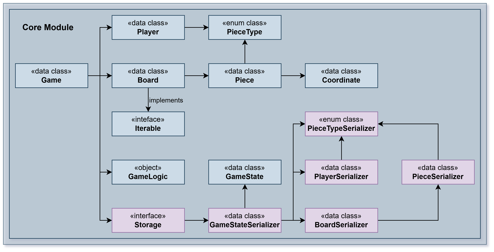

Module reversi-core

## Overview

The core domain model and game logic for the Reversi game. This module is completely UI-agnostic and
persistence-agnostic,
exposing only pure Kotlin data types and functions that implement the Reversi game rules. It is designed to be used
by any client (CLI, GUI, test code, etc.) without modification or dependency on any UI or storage framework.

The module follows clean architecture principles with explicit domain modeling, immutable data structures, and pure
functions that return new instances rather than modifying state. This design makes it inherently testable and
thread-safe.



## Architecture

The module is organized into several focused packages:

- **Core Package** — Main game types and orchestration
- **Board Package** — Board model and piece management
- **Storage Package** — Data Transfer Objects (DTOs) for persistence
- **Exceptions Package** — Domain-specific exceptions

All transformations are deterministic and return new instances. The game state is immutable, making it easy to
implement features like undo/redo, concurrent play, and state recovery.

## Key Concepts

### Game

The central type representing a Reversi game session. It is an immutable data class that carries:

- The current board state
- Player information and points
- Game metadata (name, player piece types)
- Storage references for persistence
- Game mode information (local vs networked)

The Game type provides methods like `play()`, `pass()`, and `refresh()` to transform the game state while handling
all validation and rules enforcement.

### GameLogic

A singleton object containing pure game logic functions:

- `play()` — Validates a move and returns the new board with captured pieces flipped
- `getAvailablePlays()` — Computes all legal moves for a player
- `isValidMove()` — Checks if a move is legal

These functions never modify state; they compute and return new board instances.

### Board

An immutable representation of the 8x8 (or configurable) game grid:

- Stores pieces as a list with coordinates
- Provides safe accessors to query pieces by coordinate or linear index
- Offers transformation methods: `addPiece()`, `changePiece()`, `startPieces()`
- Implements Iterable for easy traversal

The board is designed to be efficient for both queries and transformations.

### Coordinate

Represents a position on the board with 1-based row and column indexing (1-8).
Provides:

- Arithmetic operations (+ and -)
- Boundary validation
- Alternative column representation (letters A-H)
- 8 directional neighbors for move validation

### Player

Represents a player with:

- Piece type (BLACK or WHITE)
- Current points (piece count)
- Methods to update points from the board state
- Ability to swap to the opposite color

### Piece

Represents a single piece on the board with:

- Coordinate (position)
- Piece type (BLACK or WHITE)
- Optional ghost piece flag (for UI highlighting available moves)

## Serialization

The module provides serializers in the `storage.serializers` subpackage for converting domain types to text:

- `GameStateSerializer` — Converts entire game state to/from text
- `BoardSerializer` — Converts board to/from row/col/symbol format
- `PlayerSerializer` — Converts player data
- `PieceSerializer` — Converts individual pieces
- `PieceTypeSerializer` — Converts piece symbols

This allows clean separation: the core module knows nothing about persistence, but provides the serializers
that storage modules use to read/write games.

## Configuration

The module reads configuration from `reversi-core.properties` via `CoreConfig`:

- `savesPath` — Directory where games are saved (default: "saves")
- Board size and game parameters
- Logging configuration

## Exception Handling

Domain-specific exceptions with helpful messages:

- `InvalidPlayException` — Attempted invalid move
- `InvalidGameException` — Operation on uninitialized game
- `InvalidPieceInFileException` — Malformed saved file
- `InvalidGameStateInFileException` — Corrupted game state file
- `EndGameException` — Game has ended
- `InvalidNameAlreadyExists` — Game name already used in storage

These exceptions help clients distinguish between logic errors and data corruption.

## Design Principles

1. **Immutability** — All domain types are immutable; transformations return new instances
2. **Purity** — Game logic functions have no side effects and always return the same result for the same input
3. **Simplicity** — Types are focused and single-purpose; no god objects
4. **Testability** — No external dependencies; easy to unit test every function
5. **Persistence-Agnostic** — No I/O or storage logic; serializers are external
6. **UI-Agnostic** — No UI dependencies; works with any client

This design allows the core to be used in any context (CLI, GUI, mobile, server) without modification.

#Package pt.isel.reversi.core

#Package pt.isel.reversi.core

## Overview

Provides the main game types and coordination layer. The module contains small, focused components that model the
board, pieces, players and the game orchestration. It is intentionally free of any I/O concerns so it can be used by
CLI, GUI or test code without modification.

### Key classes

- `Game` — lightweight, immutable carrier for a game session. Orchestrates moves, passes and state transitions.
- `GameLogic` — pure logic that validates moves, computes captures and available plays.
- `Player` — represents a player and provides helper methods to refresh points and swap piece type.
- `CoreConfig` — Configuration for core game settings loaded from `reversi-core.properties`
- `Environment` — Constants for file paths and configuration

### Responsibilities

- Representing the board, pieces, coordinates and piece types as immutable data types
- Enforcing move validation and piece capture rules (Reversi)
- Providing deterministic, testable transformations that return new board/game instances
- Defining small storage-friendly DTOs (GameState) used by the storage module
- Managing core configuration and environment settings

#Package pt.isel.reversi.core.board

## Overview

Contains the board model and related primitives used to represent the game grid and pieces.

### Notable types

- `Board` — immutable board representation with safe transformation methods (add/change pieces, iterate pieces)
- `Coordinate` — row/column pair with helper arithmetic and boundary checks
- `Piece` — represents a single piece on the board with coordinate and piece type
- `PieceType` — enum defining BLACK and WHITE pieces with associated symbols

### Responsibilities

- Coordinate and bounds validation
- Legal move evaluation and piece flipping helpers (used by GameLogic)
- Producing the initial board setup and iterating existing pieces
- Providing immutable board transformations

#Package pt.isel.reversi.core.game

## Overview

Core game logic and game orchestration components.

### Key Components

- `Game` — Main game class that coordinates gameplay
- `GameLogic` — Pure functions for move validation and board transformations
- `GameUtils` — Helper utilities for game operations
- `GameService` — Interface for game service implementations
- `EmptyGameService` — No-op implementation for local games
- `FakeGameService` — Mock implementation for testing
- `GameServiceImpl` — Real implementation for networked/multiplayer games

### Responsibilities

- Managing game state and flow
- Validating and executing moves
- Computing available plays
- Handling game endings
- Coordinating with external game services (multiplayer)

#Package pt.isel.reversi.core.gameState

## Overview

Data Transfer Objects (DTOs) for representing and persisting game state.

### Key Components

- `GameState` — Complete snapshot of a game including board, players, and metadata
- `Player` — Player representation with piece type and score
- `MatchPlayers` — Collection of players in a match

### Responsibilities

- Providing serializable game state representations
- Enabling game persistence and restoration
- Serving as data contracts between core and storage modules

#Package pt.isel.reversi.core.storage

## Overview

Storage-related types and contracts used by the core module to define how games are persisted.

### Key Components

- `GameStorageType` — Enum defining storage backends (FILE, MONGODB)
- `StorageParams` — Parameters for storage configuration
- `Serializer` implementations — Convert domain objects to/from storage format

### Responsibilities

- Defining storage types and configurations
- Providing serialization contracts
- Bridging between core domain and storage implementations

#Package pt.isel.reversi.core.storage.serializers

## Overview

Serializer implementations for converting core domain types to/from text format for persistence.

### Serializers

- `GameStateSerializer` — Serializes complete game state to/from text
- `BoardSerializer` — Serializes board configuration (size and pieces)
- `PlayerSerializer` — Serializes player data (type and points)
- `PieceSerializer` — Serializes individual piece positions
- `PieceTypeSerializer` — Serializes piece type symbols (# for BLACK, @ for WHITE)

### Responsibilities

- Converting immutable domain objects to text representation
- Parsing text files back to domain objects
- Ensuring round-trip serialization preserves data integrity
- Providing human-readable save file format

### Format Example

```
#,12;@,5;
#

8
4,4,@
4,5,#
5,4,#
5,5,@
```

First line: Players (symbol, points)  
Second line: Last player  
Third line: Winner (if any)  
Fourth line: Board size  
Remaining lines: Pieces (row, col, symbol)

#Package pt.isel.reversi.core.exceptions

## Overview

Domain-specific exceptions that signal invalid operations or corrupted persisted files (for example: malformed
board or piece entries). These exceptions are thrown by the core logic or by the serializers when encountering
invalid data.

### Exception Types

- `ReversiException` — Base exception for all Reversi-specific errors
- `ErrorType` — Enum categorizing error severity (INFO, WARNING, ERROR, FATAL)
- `InvalidPlayException` — Thrown when attempting to play an invalid move
- `InvalidGameException` — Thrown when game operations are invoked on an unstarted game
- `InvalidPieceInFileException` — Thrown when a persisted file contains malformed piece data
- `InvalidPieceTypeInFileException` — Thrown when an invalid piece type is encountered in a file
- `InvalidPlayerInFileException` — Thrown when player data in a file is malformed
- `InvalidGameStateInFileException` — Thrown when the overall game state file is corrupted
- `InvalidBoardInFile` — Thrown when board data in a file is invalid
- `InvalidFile` — General exception for file parsing errors
- `InvalidNameAlreadyExists` — Thrown when attempting to create a game with a name that already exists
- `EndGame` — Thrown when the game has ended (not an error, but a state signal)
- `BadStorage` — Thrown when storage operations fail

### Responsibilities

- Providing clear, user-friendly error messages
- Distinguishing between user errors and system errors
- Supporting graceful error handling throughout the application
- Enabling specific error handling for different failure scenarios
